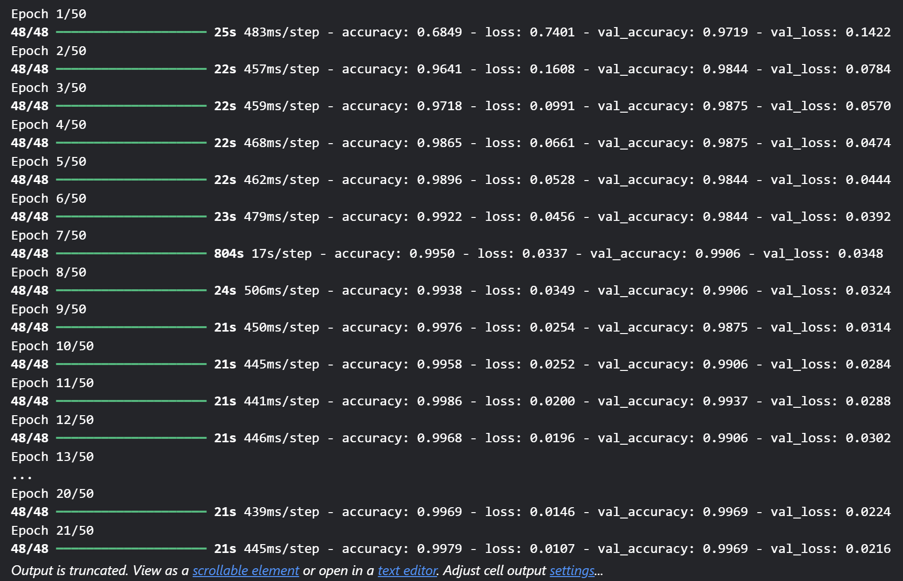
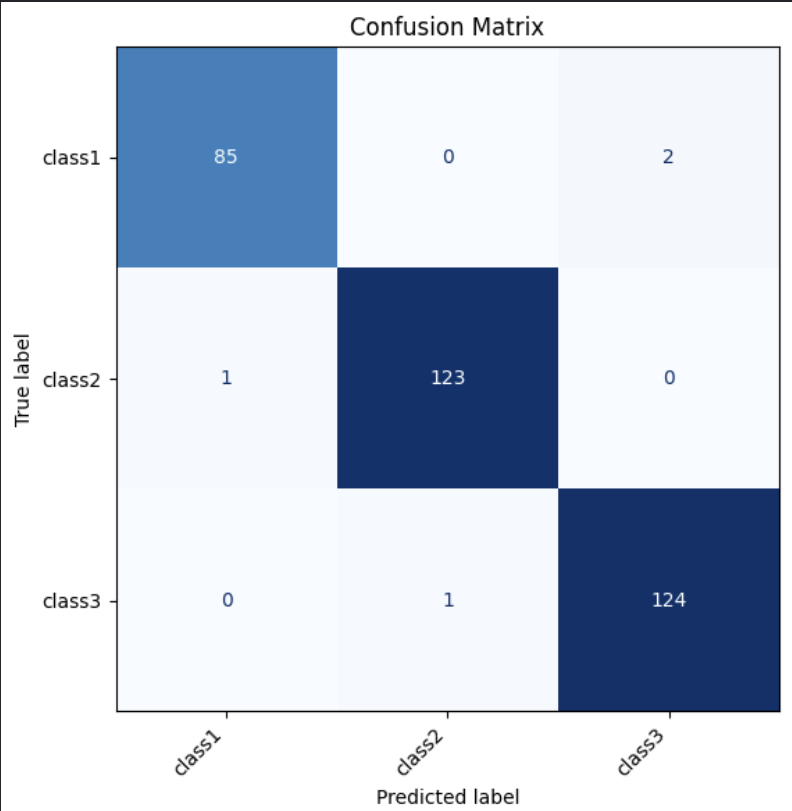

# 🎮 Proyek Klasifikasi Gambar Batu, Kertas, Gunting

**Nama**: Iwani Khairina
**NIM**: 2208107010078

---

## 📝 Ringkasan Proyek

Proyek ini bertujuan untuk membangun sistem klasifikasi gambar menggunakan metode *Transfer Learning* dengan arsitektur **MobileNetV2**. Model akan mengenali tiga kategori gambar, yaitu:

* 🪨 Batu (*Rock*)
* 📄 Kertas (*Paper*)
* ✂️ Gunting (*Scissors*)

Model yang telah dilatih akan diintegrasikan ke dalam aplikasi backend berbasis **FastAPI**, yang memungkinkan pengguna mengirim gambar dan menerima prediksi secara langsung.

---

## ⚙️ Teknologi yang Digunakan

* **TensorFlow / Keras** → Untuk membangun dan melatih model klasifikasi.
* **FastAPI** → Untuk membuat REST API backend.
* **Uvicorn** → Server untuk menjalankan aplikasi FastAPI.
* **Pillow (PIL)** → Untuk memproses gambar.
* **NumPy** → Untuk manipulasi data numerik.
* **scikit-learn** → Untuk evaluasi performa model (*classification report*, *confusion matrix*).

---

## 🗂️ Struktur Direktori Proyek
Tugas3-Pembelajaran_Machine_Learning/
├── backend/
│ ├── main.py # Kode utama backend (FastAPI)
│ └── requirements.txt # Dependensi backend
├── frontend/
│ ├── main.py # Tampilan frontend (misal: Streamlit)
│ └── requirements.txt # Dependensi frontend
├── model/
│ └── best_transfer.keras # File model hasil pelatihan
├── dataset/
│ ├── rock/
│ ├── paper/
│ └── scissors/
└── README.md

## 🚀 Langkah Penggunaan

### 1. Clone Repository

```bash
git clone https://github.com/iwanikhairina/Tugas-3_IwaniKhairina_2208107010078
```

### 2. Siapkan Environment Python
Gunakan Python versi 3.9 sampai 3.11.
Buat environment baru, lalu install semua dependency dengan:
```bash
pip install -r requirements.txt
```

### 3. Dataset
Unduh dataset dari Kaggle:
🔗 Rock-Paper-Scissors Dataset – Kaggle
Struktur folder dataset yang dibutuhkan:
```bash
dataset/
├── rock/
├── paper/
└── scissors/
```

### 4. Menjalankan Program
✅ Frontend (Streamlit)
Masuk ke folder frontend/ lalu jalankan:
```bash
streamlit run app.py
Streamlit akan berjalan di: http://localhost:8501
```

### ✅ Backend (FastAPI)
Masuk ke folder backend/ lalu jalankan:
```bash
uvicorn main:app --host 0.0.0.0 --port 8000 --reload
Server API akan aktif di: http://localhost:8000
```

## 🎯 Tujuan Pembelajaran

- Mengenal proses lengkap dari pelatihan hingga penyebaran (deployment) model machine learning.
- Mengasah kemampuan integrasi model ke dalam sistem backend yang berjalan nyata.
- Menumbuhkan kebiasaan dalam menyusun proyek yang terstruktur rapi dan terdokumentasi dengan baik.
---

## 📋 Hasil Model dan Tampilan Frontend

- Training Model <br>
)

- Evaluasi Model <br>


- Evaluasi Model <br>
.png) <br>
.png)


